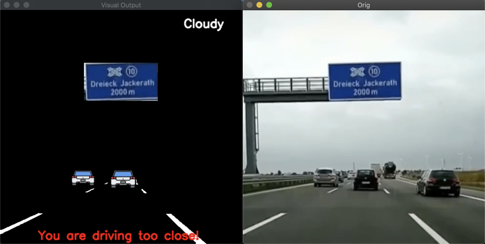

# ADAS_using_OpenVino
Advanced Driver Assistance System (team-project) - developed for the Intel Edge AI Scholarshap @Udacity

## PLEASE CLICK for watching the Video
[](https://youtu.be/mfI0uvXCe48)

## Motivation
Making roads a safer place and ADAS available to the majority of people, not only to those who can’t afford a new Car with special and expensive addons with Intel Hardware and Software plotform.OpenVino offers a great opportunity as we can bring AI based analysis to the edge (for example inside a smartphone sized device mounted in your car and connected the cars board computer). OpenVINO also helps in quick deployment and polymorphism of some code on multiple devices like intel GPU,CPU and accelerators like HDDL and FPGA.

## Our Mission
- making driving safer and more convenient
- bridging time until cars get fully autonomous and are affordable for the majority of people
- making ADAS accessible for everyone in form of an Edge Device that can be plugged in to the board computer of your current car with no need to purchase a completely new car (most of the cars built after 2009 support that)

## Current Features
- [x] **Car detection**
- [x] **Tracking speed visually**
- [x] **tracking distance to car in front of us**
- [x] based on speed and distance -> **calculating if minimum breaking distance is kept**
- [x] **Detection of blue direction signs** on german highways (to be replaced by a model-based sign detection in the near future)
- [x] **Weather detection** (will be used to increase the minimum breaking distance in case it is raining)[(Follow for detailed explanation)](Weather_Classification)
- [x] displaying lane-lines
- [x] **Emotion Detection of the driver** [(Follow for detailed explanation)](DriverEmotionDetection)

## Features we are currenlty working on
- [ ] road sign detection, to also include for example warnings for Stop-signs
- [ ] improvement of car-detection
- [ ] To improve accuracy of drowsiness detection model  and FPS on MYRIAD.
- [ ] Itegrate it with AWS/AZURE-ML deployment

## Planned Features
- tracking of pedestrians, bikes etc. to the make the application more secure for urban usage
- traffic-light detection to automatically break/accelerate
- model-based lane-detection (in the future used to keep the lane)
- constantly improve on accuracy and execution time
- visualized roadsigns with text-detection
- Identify the sleep state of Driver and Integrate it with Azure/AWS ML deployments.

## Execution Instructions
(Note: The project uses a 2019 version of OpenVino, which still has to include a CPU_EXTENSION directory to run, it is set by default for macOS, for other OS's it needs to be passed in the with input argument ```-c```)
### For macOS
- clone or download the repository
- if you have OpenVino installed with root permision, in your terminal run ```sudo -i```
- Source the OpenVino environment by executing following on your terminal: ```source /opt/intel/openvino/bin/setupvars.sh```
- In your terminal change the directory to the repository folder that contains main.py
- run it better executing ```python3 main.py```

### For Windows
- clone or download the repository
- OpenVINO Installation document for windows https://docs.openvinotoolkit.org/latest/_docs_install_guides_installing_openvino_windows.html
-  A window opens to let you choose your installation directory and components. The default installation directory is C:\Program Files (x86)\IntelSWTools\openvino_<version>, for simplicity, a shortcut to the latest installation is also created: "C:\Program Files (x86)\IntelSWTools\openvino"
- Source the OpenVino environment by executing following on your terminal: ```cd C:\Program Files (x86)\IntelSWTools\openvino\bin\``` and ```setupvars.bat```
- In your terminal change the directory to the repository folder that contains main.py
- run it better executing ```python3 main.py```


# Acknowledgments/Licenses
- Intel Edge AI Scholarship Challenge
- Car-Icon made by "Nikita Golubev" "https://www.flaticon.com/authors/nikita-golubev" from https://www.flaticon.com/"
